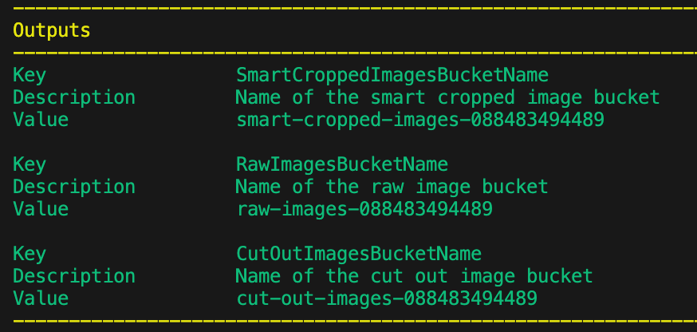

# Automated image processing at scale
This application uses AWS Serverless and Adobe API endpoints to automate image manipulation at scale. It was designed to process player photos for sporting industries but can be modified for many other uses. When images are dropped into the raw-image bucket they are sent to Adobe to have the background removed. We then use Rekognition to identify the facial landmarks of the player and crop the photo according to the desired height of the body. The result is uniform sizing across all the images.

The entire process is event driven. When images are furst dropped in the RawImagesBucket, this triggers the CutOutStateMachine to call the Adobe API to process the image. The updated image is then dropped in the CutOutImagesBucket which triggers the next step and so on.

*Note: this application was built using AWS Application Composer. If you are using VSCode and have the latest AWS Toolkit installed. There is an icon in the top left that will open this project in a local version of App Composer.*


**AWS services used**
* AWS Step Functions
* AWS Lambda
* Amazon EventBridge
* Amazon S3
* AWS Secrets Manager
* AWS App Composer (for building)
* Amazon Rekognition

**Adobe APIs used**
* Adobe Photoshop CutOut API

## Preparing to install

### Requirements
* An Adobe developer account https://developer.adobe.com/
* An AWS account https://aws.amazon.com/free/
* AWS CLLI https://docs.aws.amazon.com/cli/latest/userguide/getting-started-install.html
* AWS SAM https://docs.aws.amazon.com/serverless-application-model/latest/developerguide/install-sam-cli.html
* Docker

### Steps
**Adobe**
1. Create a new project in the Adobe Developer console.
1. Add the Photoshop API
1. Retrieve the ClientId, Client Secret, and Organization ID from the Credentials (Oauth server to server) section

**AWS**
1. In the Amazon EventBridge console, create a new connection with the following information.
    * Authorization type: OAuth Client Credentials
    * Authorization endpoint: https://ims-na1.adobelogin.com/ims/token/v3
    * Http method: POST
    * Client Id: `Client ID from Adobe`
    * Client Secret: `Client Secret from Adobe`
    * Under *Invocation Http Parameters*
        * x-api-key (Secret header): `Client ID from Adobe`
        * x-gw-ims-org-id (Secret header): `Organization ID from Adobe`
    * Under *OAuth Http Parameters*
        * grant_type (Body field): client credentials
        * scope (Body field): openid, AdobeID, read_organizations

    *Once you have an authorized connection, copy the ARN for the next steps*

1. From within the root of the project, build the stack using AWS SAM (--use-container tells SAM to build using containers instead of you having to configure node and python.)
    ```
    sam build --use-container
    ```
1. The deploy the stack using AWS SAM (The -g is a guided deploy)
    ```
    sam deploy -g
    ```
    * Choose your desired stack name
    * Choose your region
    * Enter the ARN from your connection
    * take defaults for the rest

## Testing the service
After deployment, the following resources are in place. These are logical names to help understand what they are doing.


The stack will also output the list of buckets for your files. It will look similar to this:



Copy as many raw images into the RawImagesBucket as you like. Each one will run through the entire process.

1. Background removed: saved to CutOutImagesBucket
1. Image smart cropped: saved to the SmartCroppedBucket

## Tear down
1. First, make sure all buckets are empty
1. Run the following AWS SAM command:
    ```
    sam delete
    ```